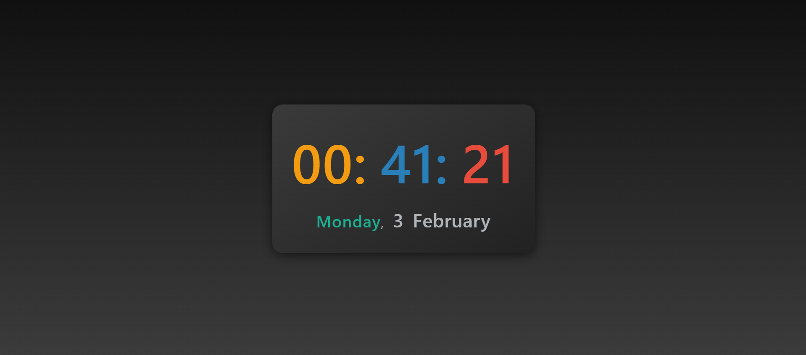

# Time and Date Widget

A sleek, modern widget that displays the current time and date in an attractive, responsive design. The widget features a smooth gradient background, dynamic color transitions, and animated clock elements.

## Features

- Displays current time with hours, minutes, and seconds.
- Shows the current day of the week and date.
- Elegant visual effects, including color transitions and shadow animations.
- Fully responsive design: adapts seamlessly to different screen sizes.
- Stylish gradient background and text animations for a more interactive experience.

## Preview

Here’s how the widget looks:

The widget dynamically updates the time and date every second, with vibrant color-coded time elements (Hours: Orange, Minutes: Blue, Seconds: Red). The date is displayed in a calm cyan tone for easy readability.

## How it Works

1. **HTML Structure**: The HTML provides the basic structure of the widget, including placeholders for displaying the time and date (`.clock-container` for the time and `.date-container` for the date).
2. **JavaScript**: The JavaScript file (`script.js`) handles the dynamic behavior. It uses the `Date()` object to get the current time, day, and date. The time is updated every second using `setInterval()`, and the display is updated by modifying the DOM.
   - The `formatTime()` function ensures the time is displayed in the "00:00:00" format.
   - The `updateClock()` function updates both the time and date every second.
3. **CSS Styling**: The CSS defines the look of the widget, with smooth transitions, gradient backgrounds, and color-coded time elements.
   - It uses media queries to make the widget responsive on different screen sizes.
   - Hover effects are included for an interactive feel, where the widget scales up and enhances its shadow.

## Usage

1. Download or clone the repository.
2. Open the `index.html` file in your browser to see the widget in action.
   

## Technologies Used

- HTML5
- CSS3
- JavaScript (Vanilla)
  
## Customization

You can easily modify the appearance or behavior of the widget by adjusting the CSS or JavaScript files:
- Change the color scheme by editing the `background`, `color`, and `font-size` properties in the CSS.
- Modify the date and time format or add additional features using the `script.js` file.

## Contributing

Contributions are always welcome! If you have any suggestions or improvements, feel free to fork the repository, make changes, and submit a pull request. Here’s how you can contribute:
   
1. Fork the repository.
2. Create a new branch.
3. Make your changes.
4. Commit your changes.
5. Push to the branch.
6. Create a new pull request.

---

Time waits for no one, but this widget will always keep you up to date! 😄
